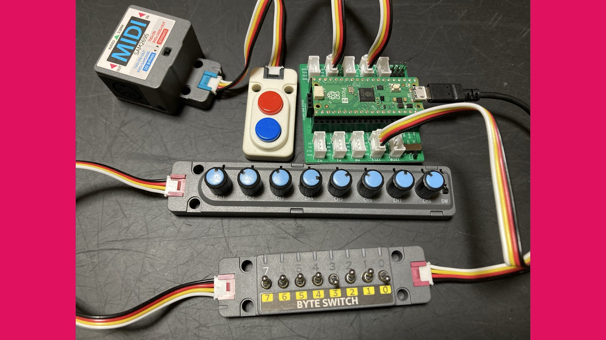
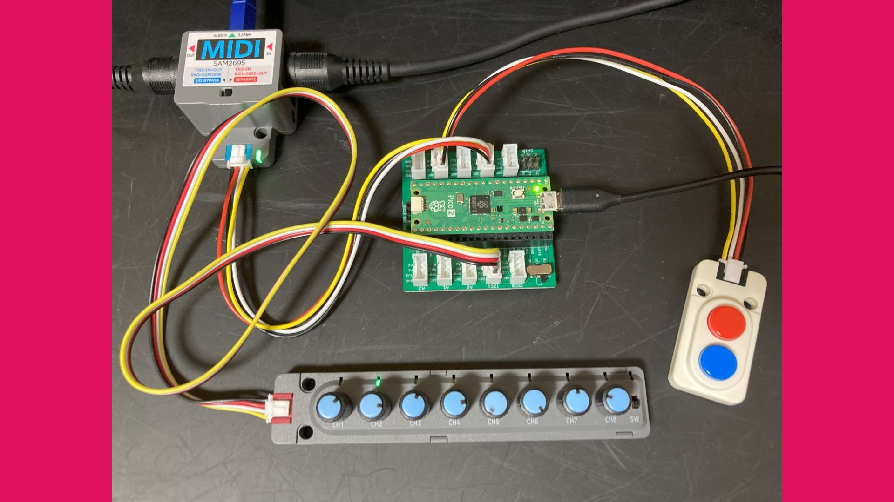
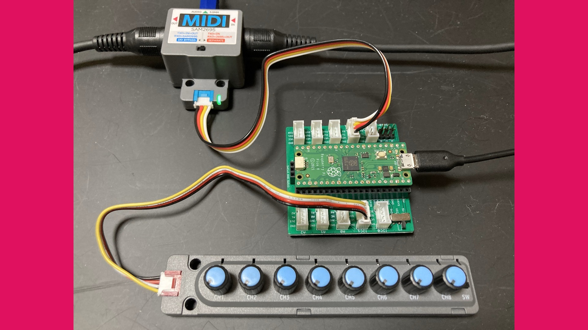

MIDI Controller PRMC-1
======================

MIDI Controller made with PicoRuby/R2P2 by ISGK Instruments (Ryo Ishigaki)

https://github.com/risgk/midi_controller_prmc1

PRMC-1 (type-9)
---------------

- Based on PRMC-1 (type-8), with the CH6 and CH7 Knobs for Brightness (Cutoff) and Harmonic Content (Resonance)
- Required Software: R2P2 PICORUBY 4.0.4 PICO2_W, R2P2 Web Terminal
- Required Hardware: Raspberry Pi Pico 2, Grove Shield for Pi Pico, M5Stack Unit 8Angle, M5Stack Unit ByteSwitch, M5Stack Unit Dual Button, and M5Stack Unit MIDI

PRMC-1 (type-8)
---------------

- Required Software: R2P2 PICORUBY 4.0.3 PICO2_W, R2P2 Web Terminal
- Required Hardware: Raspberry Pi Pico 2, Grove Shield for Pi Pico, M5Stack Unit 8Angle, M5Stack Unit ByteSwitch, M5Stack Unit Dual Button, and M5Stack Unit MIDI

PRMC-1 (type-7)
---------------

- Required Software: R2P2 PICO2_W 0.5.0
- Required Hardware: Raspberry Pi Pico 2, Grove Shield for Pi Pico, M5Stack Unit 8Angle, M5Stack Unit ByteSwitch, M5Stack Unit Dual Button, and M5Stack Unit MIDI

PRMC-1 (type-6)
---------------

- Required Software: R2P2 PICO2_W 0.5.0
- Required Hardware: Raspberry Pi Pico 2, Grove Shield for Pi Pico, M5Stack Unit 8Angle, M5Stack Unit ByteSwitch, M5Stack Unit Dual Button, and M5Stack Unit MIDI

PRMC-1 (type-5)
---------------

- Based on the pentatonic scale
- Required Software: R2P2 PICO2_W 0.5.0
- Required Hardware: Raspberry Pi Pico 2, Grove Shield for Pi Pico, M5Stack Unit 8Angle, M5Stack Unit Dual Button, and M5Stack Unit MIDI

PRMC-1 (type-4)
---------------

- Required Software: R2P2 PICO2_W 0.5.0
- Required Hardware: Raspberry Pi Pico 2, Grove Shield for Pi Pico, M5Stack Unit 8Angle, M5Stack Unit Dual Button, and M5Stack Unit MIDI

PRMC-1 (type-3)
---------------

- Required Software: R2P2 PICO2_W 0.5.0
- Required Hardware: Raspberry Pi Pico 2, Grove Shield for Pi Pico, M5Stack Unit 8Angle, M5Stack Unit Dual Button, and M5Stack Unit MIDI

PRMC-1 (type-2)
---------------

- Required Software: R2P2_PICO 0.4.1 (and mruby compiler 3.3.0)
- Required Hardware: Raspberry Pi Pico, Grove Shield for Pi Pico, M5Stack Unit 8Angle, M5Stack Unit Dual Button, and M5Stack Unit MIDI

PRMC-1 (type-1)
---------------

- Same features as PRMC-1 (type-0)
- Required Software: R2P2_PICO 0.4.1 (and mruby compiler 3.3.0)
- Required Hardware: Raspberry Pi Pico, Grove Shield for Pi Pico, M5Stack Unit 8Angle, and M5Stack Unit MIDI

PRMC-1 (type-0)
---------------

- See [Making a MIDI controller device with PicoRuby/R2P2 (RubyKaigi 2025 LT)](https://speakerdeck.com/risgk/r2p2-rubykaigi-2025-lt)
- Required Software: R2P2 0.3.0
- Required Hardware: Raspberry Pi Pico, Grove Shield for Pi Pico, M5Stack Unit 8Angle, and M5Stack Unit MIDI

